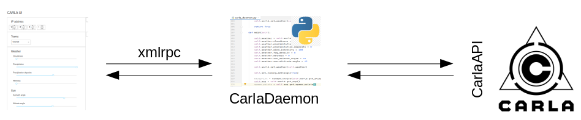
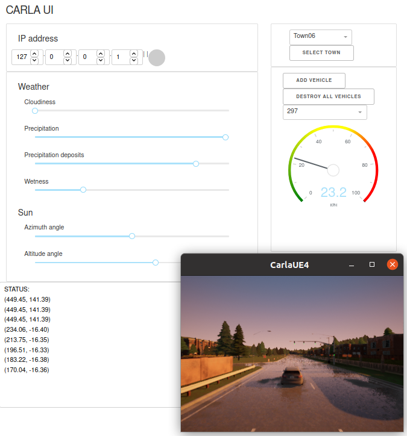

# CARLA UI



### Usage

> Adapt **carla_egg_path** in carla_daemon.py to your environment.

```shell
try:
    carla_egg_path = '../../CARLA_0.9.9/PythonAPI/carla/dist/carla-*%d.%d-%s.egg'
    sys.path.append(glob.glob(carla_egg_path % (sys.version_info.major,
                                                sys.version_info.minor,
                                                'win-amd64' if os.name == 'nt' else 'linux-x86_64'))[0])
except IndexError:
    print('CARLA PythonAPI not found')
    sys.exit()
```

> Start **CARLA server** in a dedicated console, serving on port 2000.

```shell
./CarlaUE4.sh -resX=640 -resY=480
```

> Start **carla-ui.py**

```shell
python3 carla-ui.py
```

### Gallery



### Known issues

 - IP address is not used
 - Green LED next to IP address is also inactive
 - Status panel has a reduced functionality
 
